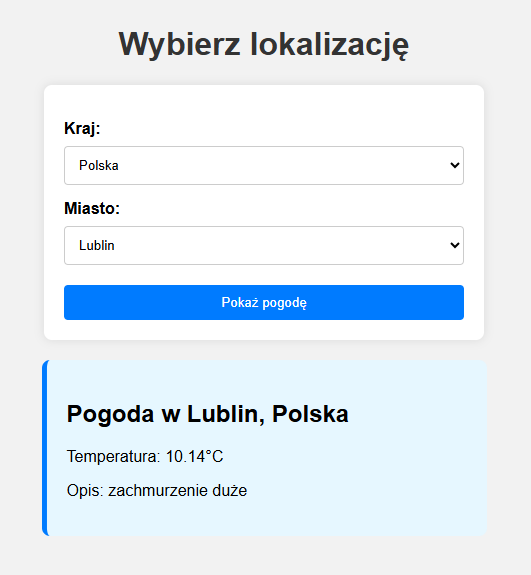
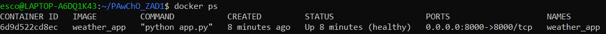
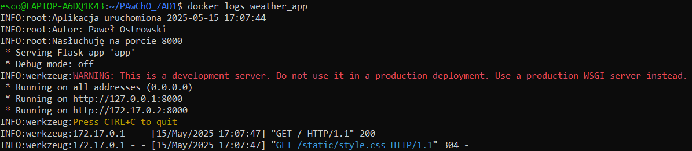
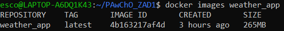

# Link do DockerHub:
https://hub.docker.com/r/ostrowski2000/zad1
lub
```bash
docker pull ostrowski2000/zad1
```

# Wynik działania kontenera:


# Wynik polecenia HEALTHCHECK:


# Polecenia niezbędne do:
a. zbudowania opracowanego obrazu kontenera
```bash
docker build -t weather_app .
```
b. uruchomienia kontenera na podstawie zbudowanego obrazu
```bash
docker run -d -e OPENWEATHER_API_KEY=$OPENWEATHER_API_KEY -p 8000:8000 --name weather_app weather_app
```
c. uzyskania informacji z logów, które wygenerowała opracowana aplikacja podczas uruchamiana kontenera
```bash
docker logs weather_app
```

d. sprawdzenia ile warstw posiada zbudowany obraz
```bash
docker history weather_app:latest
docker history --no-trunc --format '{{.CreatedBy}}' weather_app:latest | wc -l
```

oraz jaki jest rozmiar obrazu
```bash
docker images weather_app
```
