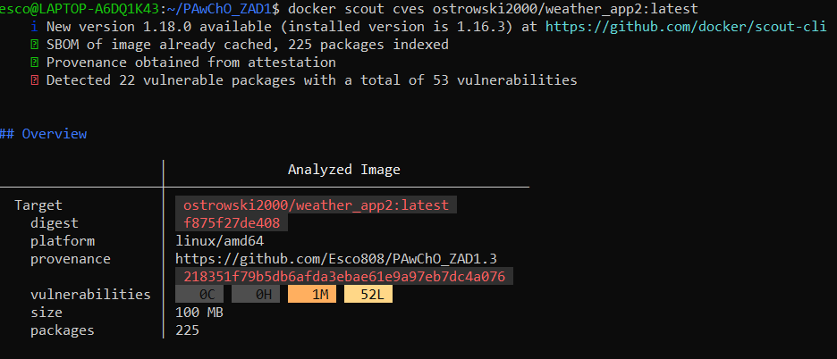
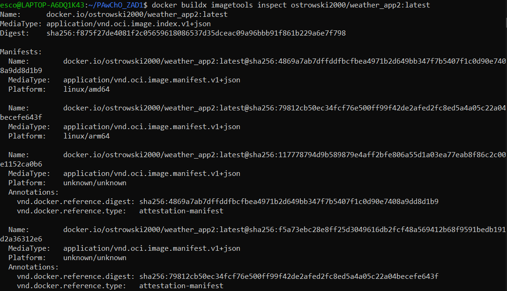
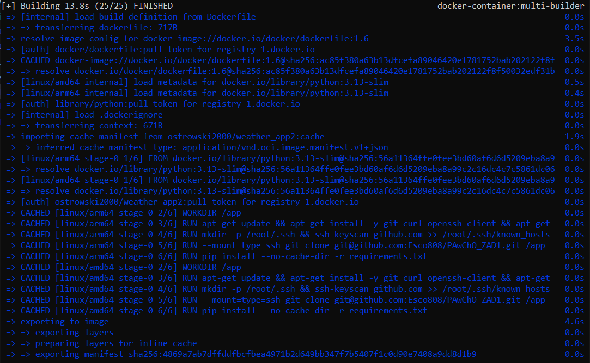

# Link do DockerHub:
https://hub.docker.com/r/ostrowski2000/weather_app2
lub
```bash
docker pull ostrowski2000/weather_app2
```

# Wynik analizy Docker Scout:


# Manifest:


# Dowód wykorzystania cache:


# Polecenia niezbędne do zbudowania obrazu i uruchomienia kontenera:
```bash
docker buildx build \
--platform linux/amd64,linux/arm64 \
--push --tag ostrowski2000/weather_app2:latest \
--ssh default \
--build-arg BUILDKIT_INLINE_CACHE=1 \
--cache-from=type=registry,ref=ostrowski2000/weather_app2:cache \
--cache-to=type=registry,ref=ostrowski2000/weather_app2:cache,mode=max \
.

docker pull ostrowski2000/weather_app2:latest

docker run -e OPENWEATHER_API_KEY=$OPENWEATHER_API_KEY -p 8000:8000 ostrowski2000/weather_app2:latest
```